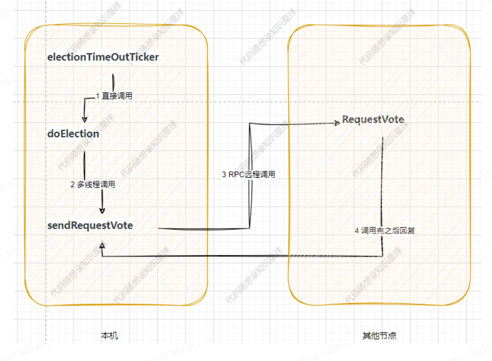
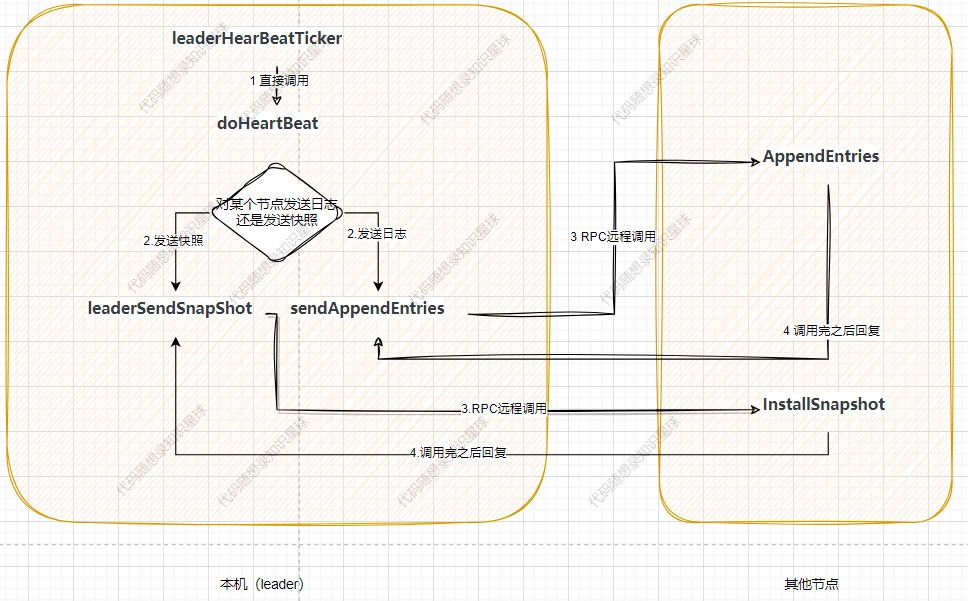

### Raft 主要流程

### 1. 领导者选举
  

  electionTimeOutTicker：负责查看是否该发起选举，如果该发起选举就执行doElection发起选举。

  doElection：实际发起选举，构造需要发送的rpc，并多线程调用sendRequestVote处理rpc及其相应。

  sendRequestVote：负责发送选举中的RPC，在发送完rpc后还需要负责接收并处理对端发送回来的响应。

  RequestVote：接收别人发来的选举请求，主要检验是否要给对方投票。
  
### 2. **日志复制|心跳**

leaderHearBeatTicker:负责查看是否该发送心跳了，如果该发起就执行doHeartBeat。

doHeartBeat:实际发送心跳，判断到底是构造需要发送的rpc，并多线程调用sendRequestVote处理rpc及其相应。

sendAppendEntries:负责发送日志的RPC，在发送完rpc后还需要负责接收并处理对端发送回来的响应。

leaderSendSnapShot:负责发送快照的RPC，在发送完rpc后还需要负责接收并处理对端发送回来的响应。

AppendEntries:接收leader发来的日志请求，主要检验用于检查当前日志是否匹配并同步leader的日志到本机。

InstallSnapshot:接收leader发来的快照请求，同步快照到本机。
### 3. 安全性可靠

### 定时器维护
主要包括raft向状态机定时写入（applierTicker ）、心跳维护定时器（leaderHearBeatTicker ）、选举超时定时器（electionTimeOutTicker ）
### 持久化相关
